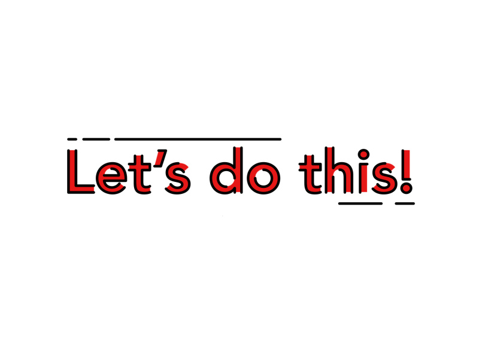
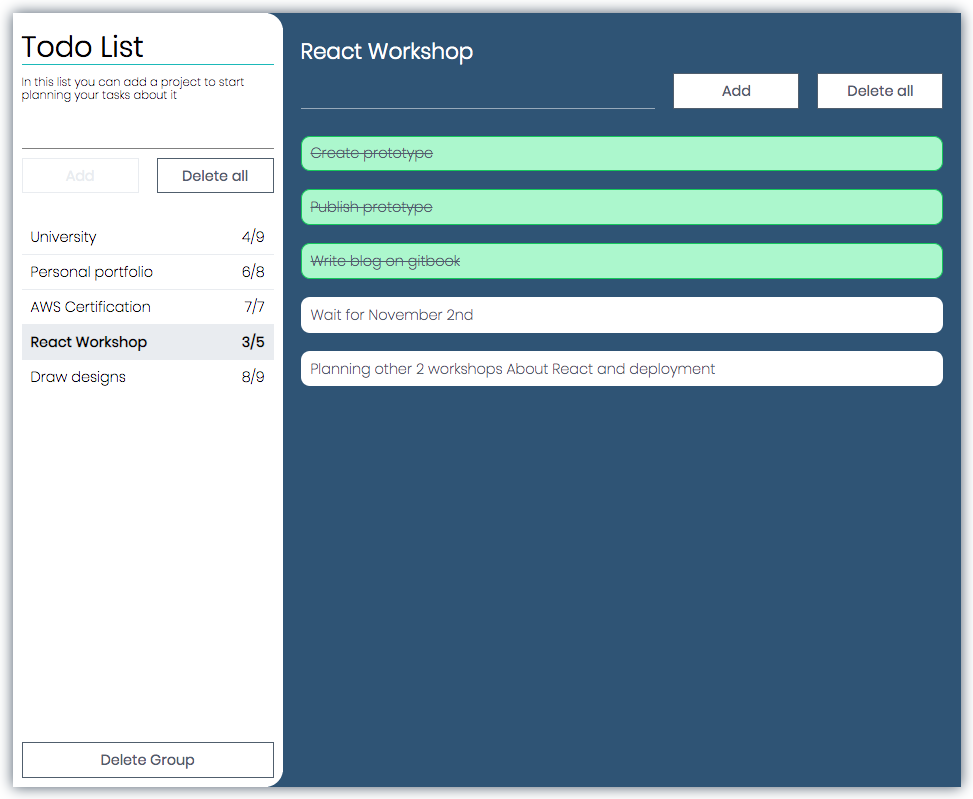
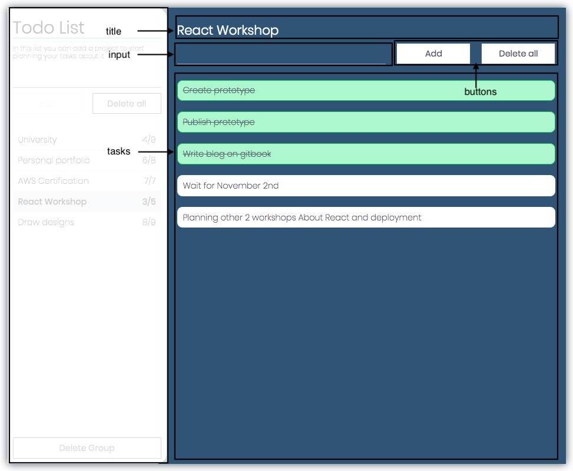
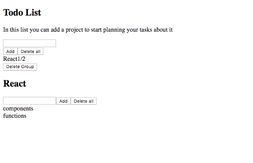

# Todolist - Creating Components

Great!! Now you have knowledge about React, and how it basically works, **lets work and create our Todolist App!!**



## What we gonna do?



In the todolist app that we gonna create, you can add groups of tasks, like a some project in particular, and to each group/project you can add tasks, to check if you have it done or not.

## What components do I need?

### TodolistApp component

Lets start for the main module, we can identify there two big components, the **group list** and the **task list**, we want that our app have a lot **groups**, an each group a **list of tasks;** so in the **`TodolistApp`** component state, we gonna have a **list of group** _\(at the beginning empty\)_, and a **variable that tell us which group is selected** to show his tasks _\(null by default\)_.

#### Principal components

In the render method lets define our **`GroupList`** and **`TaskList`** components that will be created next.

#### Group list component

We can see that the **group list** section have a **title** and a **description**, so we can pass them to the component as a **props**, further more the group list to render in that component.

We can define how the **group list format** will be, to be easier the management of that list, we can do that each element be a dictionary with the **name of the group**, and the **task list**.

And each **task list element** as dictionary with the **text** of the task, and a boolean if the task is **done** or not.



```javascript
groups = [
    {
        name: "Group name",
        tasks: [
            {
                text: "Task text",
                done: false
            }
        ]
    }
]
```



#### Task list component

By the moment the task list component only need the selected group to show.



```javascript
import React from 'react';
import {
  GroupList,
  TaskList
} from "components";

export default class TodolistApp extends React.Component {
  constructor(props) {
    super(props);
    this.state = {
      groups: [],
      selectedGroupIndex: null
    };
  }

  render() {
    const {groups, selectedGroupIndex} = this.state;
    const selectedGroup = groups[selectedGroupIndex];

    return (
      <main>
        <GroupList
          title="Todo List"
          description="In this list you can add a project to start planning your tasks about it"
          groups={groups}
        />
        <TaskList
          group={selectedGroup}
        />
      </main>
    );
  }
}
```



### Grouplist component

Now lets create the **`Grouplist`** component, we know that we receive as props the **title**, the **description** and the **group list** to show.


Create the component in

`src`**`>`**`components`**`>`**`groupList`**`>`**`index.js`

To handle the **input value** we management his value as state of our group list component. As you can see in **`line 8`**, in the next code.

I can specify a default value for props, with **`defaultProps`** as element of the class. So we need to specify at least for default, we gonna receive a empty group list. as you can see in **`lines 12-14`** in the code below.

In **`lines 16-27`** I define a method to render the group list, for that I map each group list element to a **`Item`** component that I will create next. By default I'll pass all attributes that a group have _**\(name, tasks\)**_ to the Item component as **`props`** to render it.



```javascript
import React from 'react';
import Item from "./item";

export default class GroupList extends React.Component {
  constructor(props) {
    super(props);
    this.state = {
      inputValue: ""
    };
  }

  static defaultProps = {
    groups: []
  };

  renderGroups = () => {
    const {groups} = this.props;

    return groups.map((group, i) => (
      <Item
        key={i}
        {...group}
      />
    ));
  };

  render() {
    const { title, description} = this.props;
    const {inputValue} = this.state;
    
    return (
      <form>
        <section>
          <h1>{title}</h1>
          <p>{description}</p>
          <input type="text" value={inputValue} />
          <section>
            <button>Add</button>
            <button>Delete all</button>
          </section>
        </section>
        <section>
          {this.renderGroups()}
        </section>
        <button>Delete Group</button>
      </form>
    );
  } 
}
```



As you can see in **`line 23`**, I destructuring the group dictionary, I mean, the following two examples _**\(destructuring and normal\)**_, pass the same props to the component...



```javascript
const group = {
    name: "name",
    tasks: []
};

<Item
    {...group}
/>
```



```javascript
const group = {
    name: "name",
    tasks: []
};

<Item
    name={group.name}
    tasks={group.tasks}
/>
```



Also, in **`line 17`**, I destructuring too



```javascript
const props = {
    groups: [],
    title: "title",
    description: "description"
};

const {groups, description} = props;
console.log(groups, description);
```



```javascript
const props = {
    groups: [],
    title: "title",
    description: "description"
};

console.log(props.groups, props.description);
```




[Read more about destructuring](https://developer.mozilla.org/en-US/docs/Web/JavaScript/Reference/Operators/Destructuring_assignment)


#### Group list item component

`src`**`>`**`components`**`>`**`groupList`**`>`** `item`**`>`**`index.js`

As the item component will not have state, I can create it as functional component that only return a component base on his props.

In **`line 7`** I use function **`filter`** to get the number of how many task are done,


[Read more about Filter function](https://developer.mozilla.org/en-US/docs/Web/JavaScript/Reference/Global_Objects/Array/filter)




```javascript
import React from 'react';

export default function Item(props) {
  const { name, tasks } = props;

  const getDoneTaskCount = () => (
    tasks.filter((task) => task.done).length
  );

  return (
    <section>
      <span>{name}</span>
      <span>{getDoneTaskCount()}/{tasks.length}</span>
    </section>
  );
}
```



### Tasklist component

Now lets create the **`Tasklist`** component, we know that we receive as props the **name** of the group, and the **task list** of the group.



Create the component in

`src`**`>`**`components`**`>`**`taskList`**`>`**`index.js`

In **`lines 16-24`** I define a method to render the task list, for that I map each task list element to a **`Item`** component that I will create next. By default I'll pass all attributes that a task have _**\(text, done\)**_ to the Item component as **`props`** to render it.



```javascript
import React from 'react';
import Item from "./item";


export default class TaskList extends React.Component {
  constructor(props) {
    super(props);
    this.state = {
      inputValue: ""
    };
  }

  static defaultProps = {
    tasks: []
  }

  renderTasks = () => {
    const {group} = this.props;
    return group.tasks.map((task, i) => (
      <Item
        key={i}
        {...task}
      />
    ));
  };

  render() {
    const {group} = this.props;
    const {inputValue} = this.state;

    if (!group) {
      return (
        <section>
          <p>No project selected</p>
        </section>
      );
    }
  
    return (
      <form>
        <section>
          <h2>{group.name}</h2>
          <section>
            <input type="text" value={inputValue} />
            <button>Add</button>
            <button>Delete all</button>
          </section>
        </section>
        <section>
          {this.renderTasks()}
        </section>
      </form>
    );
  }
}
```



#### Task list item component

`src`**`>`**`components`**`>`**`taskList`**`>`** `item`**`>`**`index.js`

As the item component will not have state, I can create it as functional component that only return a component base on his props.



```javascript
import React from 'react';

export default function Item(props) {
  const { text } = props;

  return (
    <section>
      {text}
    </section>
  );
}
```



## Export in components folder

To finish, I'll export the components from **`src/components/index.js`**



```javascript
export { default as GroupList } from './groupList';
export { default as TaskList } from './taskList';
```



## See the result

Now to test, in **`lines 10-13`**

`src`**`>`**`modules`**`>`**`index.js`

replace the state with

```javascript
this.state = {
  groups: [{
    name: "React",
    tasks: [
      {text: "components", done: false},
      {text: "functions", done: true}
    ]
  }],
  selectedGroupIndex: 0
};
```

If everything its okey, you might see the result below



If everything its okey, reset the state **`{groups: [], selectedGroupIndex: null }`** to his original state, and continue to next page to handle states, and make buttons work.

