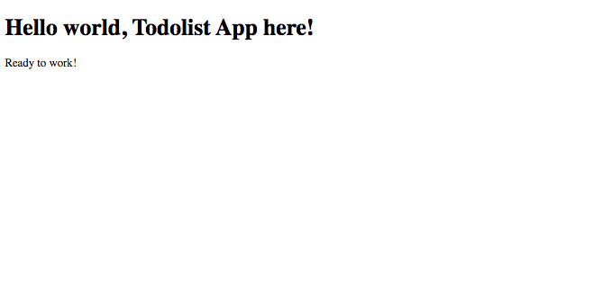

# Configure development environment

Now, we gonna configure our App file structure to work with, in a simple way to facilitate the components and modules creation.

> This is the file structure that I use to work, I don't mean that is the unique way to organize your components, but its the way what I fell confortable and it works for me. If you want to adapt it to your work or you want to use your own file structure, feel free to do it.

## **`jsconfig.json`** file

First of all, I will add the file **`jsconfig.json`** in the **root folder of my App**, to create an alias for my **`src`** folder an use an _absolute path_ to import my components, instead of a _relative path_ to them.


[Reference about `jsconfig.json`](https://code.visualstudio.com/docs/languages/jsconfig)\`\`




```javascript
{
  "compilerOptions": {
    "baseUrl": "src",
    "paths": {
      "*": ["src/*"]
    }
  },
  "include": ["src/*"]
}
```



## **`src`** file structure

Now inside **`src`** folder, I will create 3 folders with an **`index.js`** file inside in each one, and maintaining the principal **`index.js`** file in the root of **`src`** folder.


#### common

Common folder is to save all classes and components that not are part of your app, but they help you in a global context, for example as utility package.

#### components

Components is where you save all you app components individually, to reutilize and shared them between your modules \(individual pages\), for example, _Forms_, _Buttons_, _Headers_, _Sections_, etc.

#### modules

Modules is to save each individual pages of your app, for example, _Home_, _About us_, _Profile_, etc. And if any of your modules have specific components for that module, that will not be shared with other modules, you can create another **`components`** folder inside your module folder.

## ServiceWorker into common

After create that folders, I'll move the **`serviceWorker.js`** file into a folder called **`serviceWorker`** inside **`common`** folder, and renamed the file to **`index.js`**, as shown below.

`src`**`>`**`serviceWorker.js` to `src`**`>`**`common`**`>`**`serviceWorker`**`>`**`index.js`


After that we gonna export the **`ServiceWorker`** from **`common`** folder, to add it in the scope of **`common`** folder.



```javascript
import * as ServiceWorker from './serviceWorker';

export {ServiceWorker};
```



## Main App file

Now we gonna create the root component of our **Todolist** app, so in **`src/modules/index.js`**, create the main component.

> I'll explain what is a component, the methods that a component have and the lifecycle of them, in the next page. By the moment we are only creating the base structure to start to work.



```javascript
import React from 'react';

export default class TodolistApp extends React.Component {
  render() {
    return (
      <main>
        <h1>Hello world, Todolist App here!</h1>
        <p>Ready to work!</p>
      </main>
    );
  }
}
```



## Render Todolist App

Now to finish, we gonna render our App to the DOM. So in the main **`index.js`** file, in the root of **`src`** folder, we gonna import the root component of our app, and render it.



```javascript
import React from 'react';
import ReactDOM from 'react-dom';
import TodolistApp from 'modules';
import {
  ServiceWorker
} from 'common';

ReactDOM.render(
  <TodolistApp />,
  document.getElementById('root')
);

ServiceWorker.register();
```



## Todolist App, ready to work!

When you finished to configured your app, you can watch the result in the web browser, it should be something like this




Yeah!! I know, that's awful and needs styles to be more beautiful, but for now, let's first focus on the functionality of the application, understanding how to work with ReactJS, and at last we gonna add styles to make it presentable.


