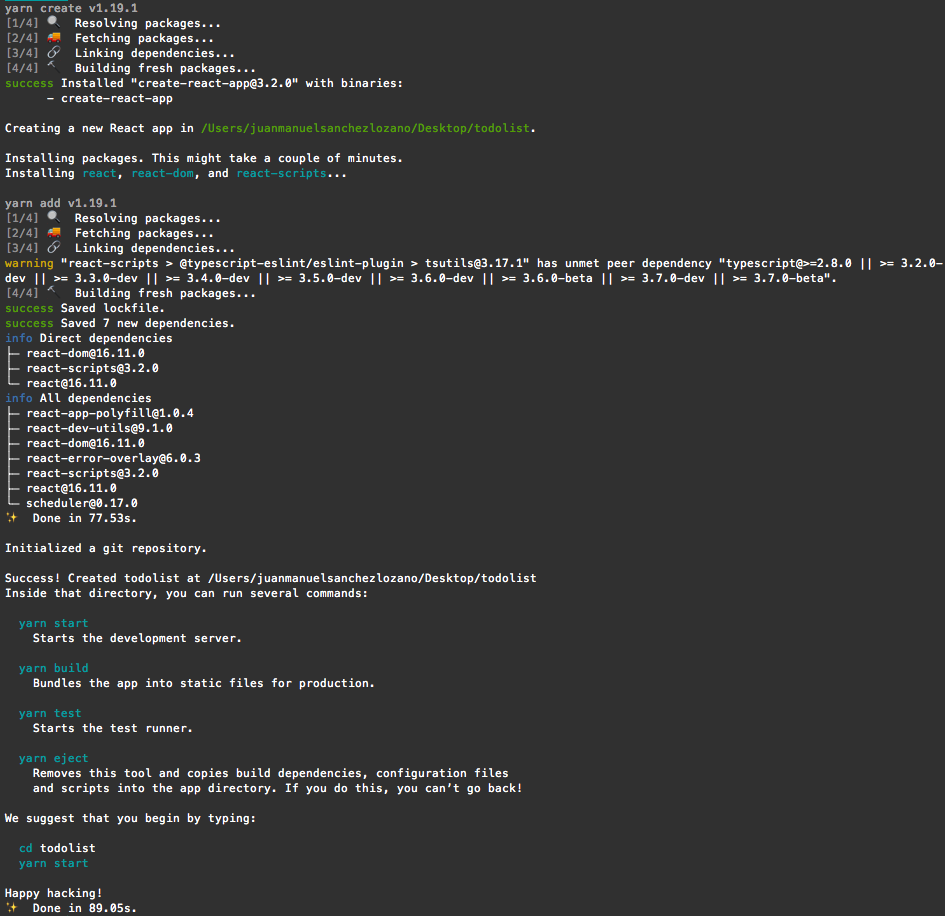
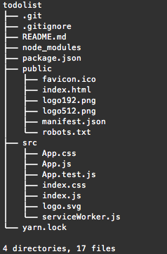

# Project creation

## Requirements before start

Before start you need to have installed [Node](https://nodejs.org/es/) \(&gt;=8.10\) on your machine _**\(it's not required on the server\)**_.

To be sure you have installed Node on your machine, just run:

```bash
node --version
```

If you are on MacOS I recommend you to install it via [Homebrew](https://brew.sh/index_es), if you are in Linux install it via your package manager distribution, or if you are in Windows, install it via their [Homepage](https://nodejs.org/es/).

## Creating an APP

To create an app, I used the command below to start my App called **`todolist`**

> If you don't use Yarn follow [this guide](https://create-react-app.dev/docs/getting-started/) that is quite similar, to create an App

```bash
yarn create react-app todolist
```



When the command finish to create your App, as the image above, we gonna see the App File structure.

## App file structure



> I'll describe the most relevant files that you should known by the moment.



### .gitignore

Git ignore file, to avoid versioning files and paths as **`node_modules`** for example.


Generate an specific gitignore file [here](https://www.gitignore.io/).


### README.md

Basic README file for git, to help people how can them use your repository.


Know more about **`README.md`** file and generate your own [here](https://www.makeareadme.com/).


### package.json

Common js package file which describes your project dependencies and configuration


Know more about the **`package.json`** file [here](https://docs.npmjs.com/files/package.json).


### yarn.lock

Lock file to registry the dependency tree of your dependencies


Know more about the **`yarn.lock`** file [here](https://yarnpkg.com/lang/en/docs/yarn-lock/).




Empty new repository for Git _**\(git config files\)**_, it can be generated running:

```bash
git init
```



Folder where your dependencies will be stored, _**\(this folder should not be versioned with git, since it can be generated automatically with the `package.json` file\)**_.


Know more about **`node_modules`** folder [here](https://docs.npmjs.com/files/folders.html#node-modules).




Folder where you can found your static files

### index.html

Main **`html`** file that server will return to the client, when they request for your webpage.

### manifest.json

The web app manifest is a simple JSON file that tells the browser about your web application and how it should behave when 'installed' on the user's mobile device or desktop. Having a manifest is required by Chrome to show the Add to Home Screen prompt.


[Web App Manifest](https://developers.google.com/web/fundamentals/web-app-manifest)


### robots.txt

A robots.txt file tells search engine crawlers which pages or files the crawler can or can't request from your site. This is used mainly to avoid overloading your site with requests**.**


[Introduction to robots.txt](https://support.google.com/webmasters/answer/6062608?hl=en)




Where you can found your dynamic files, if the file is imported by your JavaScript application or changes contents, put it here.

### index.js

Entry point of your app, where everything you import here will be used and rendered to your app.

### serviceWorker.js

A service worker is a script that your browser runs in the background, separate from a web page, opening the door to features that don't need a web page or user interaction.


Know more about service workers [here](https://developers.google.com/web/fundamentals/primers/service-workers/).





