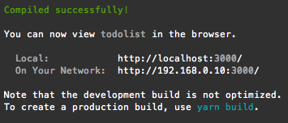
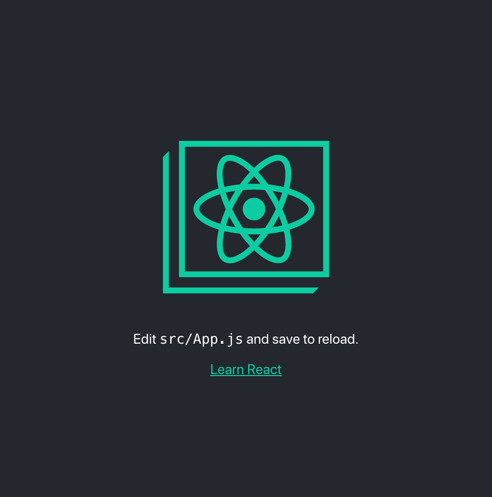
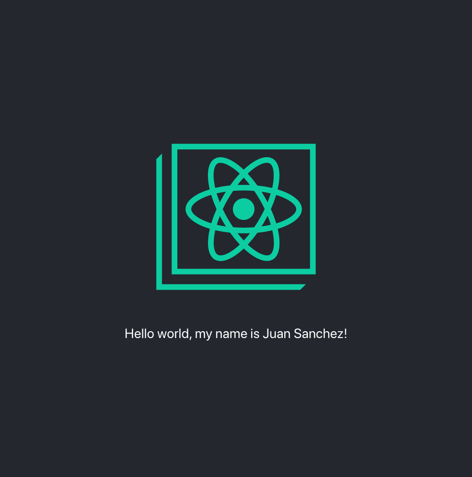

# Run and... Hello world!

## Running your app

Now that you have created your App, lets run it up. Just go to the root folder of your app and run the following command

```bash
yarn start
```

Your prompt should look something like this when you run your app successfully, and it will open a tab in the web browser with your app deployed at [http://localhost:3000/](http://localhost:3000/).



And depends in the version and the date you are looking this guide, your app running in the web browser should look something like this




If your phone is connected in the same network \(wifi\), you could watch your app from your phone entering your local ip, in my case [http://192.168.0.10:3000/](http://192.168.0.10:3000/)


### Hello world, I'm &lt;name&gt;

Now lets try something...

Open your App folder in your Text editor or IDE of your preference and open the file **`src/App.js`** it should look something like this



```javascript
import React from 'react';
import logo from './logo.svg';
import './App.css';

function App() {
  return (
    <div className="App">
      <header className="App-header">
        
        <p>
          Edit <code>src/App.js</code> and save to reload.
        </p>
        <a
          className="App-link"
          href="https://reactjs.org"
          target="_blank"
          rel="noopener noreferrer"
        >
          Learn React
        </a>
      </header>
    </div>
  );
}

export default App;
```



Edit the _`line 11`_, and write

```text
Hello world, my name is <your name>
```

Something like this

```javascript
...
        <p>
          Hello world, my name is Juan Sanchez!
        </p>
...
```

And remove **`<a>`** tag that is between _`lines 13-20`_; the final code should be something like this



```javascript
import React from 'react';
import logo from './logo.svg';
import './App.css';

function App() {
  return (
    <div className="App">
      <header className="App-header">
        
        <p>
          Hello world, my name is Juan Sanchez!
        </p>
      </header>
    </div>
  );
}

export default App;
```



If you do this correctly, you will see how after you saved the file, the app in the web browser refresh automatically and appears with the change you did



