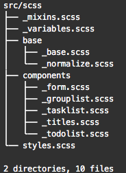

# Todolist - Adding Styles

Now lets give styles to our app, as this guide is not about CSS or SCSS, I'll not explain the styles, only will give you the styles and classname you should use.

> If you want to give a different style or layout, fell free to do it.

Before begin, as I use SCSS to create the styles, I need to install a library, being so Webpack will compile the SCSS files to css.


To know more about SCSS read this [article](https://sass-lang.com/guide).


To install this package install the library **`node-sass`**

```bash
yarn add node-sass
```

After install it, restart the development server.

## Class names



```java
...
  <main className="todolist-app">
...
```



In the next code, we are passing another prop that its boolean, if the current group is selected or not.



```javascript
...
  renderGroups = () => {
    const { groups, selectGroup, selectedGroup} = this.props;

    return groups.map((group, i) => (
      <Item
        key={i}
        onClick={() => selectGroup(i)}
        selected={group === selectedGroup}
        {...group}
      />
    ));
  };
...
  return (
    <form onSubmit={this.addGroup} className="group-list">
      <section>
        <h1 className="main-title">{title}</h1>
        <p className="description">{description}</p>
        <input type="text" value={inputValue} onChange={this.handleInput} className="input" />
        <section className="group-list__buttons">
          <button className="button active" onClick={this.addGroup} disabled={isDisableAddButton}>Add</button>
          <button className="button danger" onClick={deleteGroups} disabled={isDisableDeleteAllButton}>Delete all</button>
        </section>
      </section>
      <section className="group-list__items">
        {this.renderGroups()}
      </section>
      <button className="button danger" onClick={deleteSelectedGroup} disabled={isDisableDeleteButton}>Delete Group</button>
    </form>
  );
...
```





```javascript
import React from 'react';

export default function Item(props) {
  const { name, tasks, onClick, selected } = props;

  const getDoneTaskCount = () => (
    tasks.filter((task) => task.done).length
  );

  return (
    <section onClick={onClick} className={`group-list__item ${selected ? "selected" : ""}`}>
      <span>{name}</span>
      <span>{getDoneTaskCount()}/{tasks.length}</span>
    </section>
  );
}
```





```javascript
...
  render() {
    const {group, deleteTasks} = this.props;
    const {inputValue} = this.state;

    if (!group) {
      return (
        <section className="task-list">
          <p>No project selected</p>
        </section>
      );
    }

    const isDisableAddButton = inputValue === "";
    const isDisableDeleteAllButton = group.tasks.length === 0;
  
    return (
      <form className="task-list">
        <section>
          <h2>{group.name}</h2>
          <section className="task-list__buttons">
            <input className="input" type="text" value={inputValue} onChange={this.handleInput} />
            <button className="button" onClick={this.addTask} disabled={isDisableAddButton}>Add</button>
            <button className="danger" onClick={deleteTasks} disabled={isDisableDeleteAllButton}>Delete all</button>
          </section>
        </section>
        <section className="task-list__items">
          {this.renderTasks()}
        </section>
      </form>
    );
  }
...
```





```javascript
import React from 'react';

export default function Item(props) {
  const { text, done, onClick } = props;

  return (
    <section onClick={onClick} className={`task-list__item ${done ? "done" : ""}`}>
      {text}
    </section>
  );
}
```



## Styles

Now download the following file in src folder and unzip it.



The src folder should look like this



Now to use the styles, you must **import** them where you want to use them, as I created a global styles independent from the components, I should import styles just 1 time, but if you want to create styles per component, you can create an CSS or SCSS file inside each component folder and import the respective file.



```javascript
...
import 'scss/styles.scss';
...
```



## WE FINIIIISH!!!

Now you have your first React App, feel free to test it, to modify it, to explore more about React.

ReactJS have a lot of thing you can use to improve your frontend skills.


